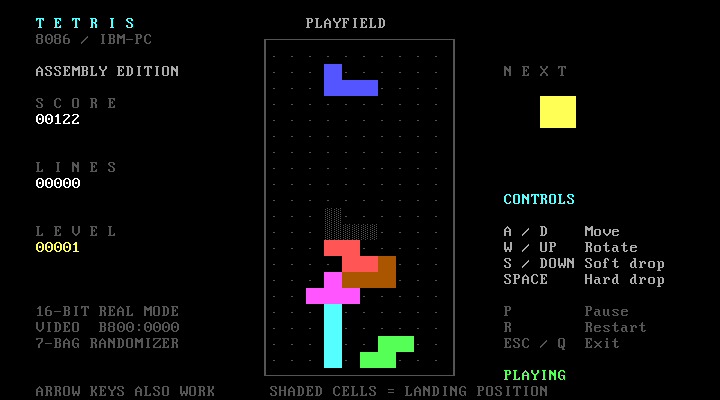

# 8086 汇编俄罗斯方块

一个适合 IBM-PC 汇编课程设计的俄罗斯方块：**游戏主体全部使用 16 位 8086 汇编编写**，汇编为 DOS `.COM` 程序，在 **DOSBox-X** 中运行。游戏不依赖 C/C++、Python 或游戏引擎。

推荐组合：**NASM（汇编器）+ DOSBox-X（模拟器）**。NASM 把源码转换成机器码；DOSBox-X 提供运行这些机器码所需的 CPU、DOS 和显示环境。



本快照需要先安装 NASM 与 DOSBox-X，再从源码构建。附带的 [运行验证记录](docs/验证记录.md) 是原工作区历史记录，不表示本次归档已重新运行。

## 1. 已实现的功能

- 10 × 20 棋盘、I/O/T/S/Z/J/L 七种方块、七袋随机出块。
- 左右移动、顺时针旋转、自动下落、软降、瞬间落底。
- 满行消除、计分、等级及下落加速。
- 下一个方块预览、落点虚影。
- 开始界面、暂停、重新开始、游戏结束判定。
- 彩色 80 × 25 文本界面，先在内存中绘制，再复制到显存。

规则采用便于课程讲解的版本：旋转时依次尝试水平偏移 `0、-1、+1、-2、+2`；向下移动受阻后立即锁定。没有实现完整 SRS 旋转规范、向上踢墙、锁定延迟或方块暂存。

## 2. 在你的 Mac 上运行

### 第一次准备

如果已经安装 Homebrew，在“终端”运行：

```sh
brew install nasm dosbox-x
```

没有 Homebrew 时，可从 [Homebrew 官网](https://brew.sh/)按官方说明安装，再执行上面的命令。DOSBox-X 也提供[官方下载入口](https://dosbox-x.com/)。

### 启动游戏

在 Finder 中打开本项目文件夹，双击 **`run.command`**。

也可以在终端运行：

```sh
cd "/path/to/tetris8086"
bash run.sh
```

修改源代码后重新运行脚本即可重新汇编并启动。只汇编、不启动：

```sh
bash build.sh
```

生成的游戏是 `build/TETRIS.COM`；`build/tetris.lst` 汇编清单可用于检查源指令对应的机器码与地址。已有 `.COM` 时，启动脚本也支持只安装 DOSBox-X 后直接运行。

## 3. 在 Windows 上运行／交给老师演示

1. 下载并安装 [DOSBox-X](https://dosbox-x.com/) 和 [NASM](https://www.nasm.us/)，将 NASM 加入 `PATH`。
2. 将完整的 `tetris8086` 文件夹复制到 Windows，例如 `C:\tetris8086`。
3. 先运行 `build.bat` 生成 `build/TETRIS.COM`，再双击 `run.bat` 启动。

运行已有的 `build/TETRIS.COM` 不需要 NASM。若要在 Windows 上修改并重新汇编源码，另从 [NASM 官网](https://www.nasm.us/)下载 NASM，把 `nasm.exe` 所在目录加入 `PATH`，再运行 `build.bat`。

若脚本没有找到 DOSBox-X，可打开 DOSBox-X，手动输入：

```dos
mount c "C:\tetris8086\build"
c:
tetris
```

其中宿主机路径应改为你实际保存 `build` 文件夹的位置。手动启动时，建议加载项目提供的 `dosbox-x.conf`，使模拟 CPU 等设置与项目一致。

## 4. 操作方法

| 按键 | 功能 |
| --- | --- |
| Enter / 空格 | 在标题界面开始游戏 |
| ← / A | 左移一格 |
| → / D | 右移一格 |
| ↓ / S | 软降一格 |
| ↑ / W | 顺时针旋转 |
| 空格 | 瞬间落底并锁定 |
| P | 暂停／继续 |
| R | 立即重新开始 |
| Esc / Q | 退出游戏 |
| Enter / R | 在游戏结束界面重新开始 |

请先点一下 DOSBox-X 游戏窗口，使它获得键盘焦点。字母键不区分大小写。暂停期间不会处理移动、旋转或下落操作。

## 5. 计分与难度

| 操作 | 得分 |
| --- | --- |
| 手动软降 | 每下降一格 +1 |
| 瞬间落底 | 每下降一格 +2 |
| 一次消除 1 行 | 100 × 本次消行前的等级 |
| 一次消除 2 行 | 300 × 本次消行前的等级 |
| 一次消除 3 行 | 500 × 本次消行前的等级 |
| 一次消除 4 行 | 800 × 本次消行前的等级 |

初始等级为 1，每累计消除 10 行升一级，最高等级为 20。自动下落间隔从 10 个 BIOS 时钟节拍逐步缩短，等级 9 及以后固定为 2 个节拍。BIOS 时钟约每秒 18.2 个节拍，因此初始约 0.55 秒下落一格，最快约 0.11 秒一格。

分数和累计消行数使用 16 位无符号数；达到 `65535` 后保持上限，不回绕成小数。

## 6. 源码从哪里看

| 文件 | 用途 |
| --- | --- |
| `main.asm` | 程序入口、主循环、键盘、计时、界面绘制及退出 |
| `game.inc` | 方块数据、随机出块、碰撞、移动、旋转、锁定、消行、计分 |
| `dosbox-x.conf` | DOSBox-X 显示、CPU 和运行速度配置 |
| `build.sh` / `build.bat` | macOS/Linux 与 Windows 汇编脚本 |
| `run.command` / `run.sh` / `run.bat` | 启动脚本 |
| `build/TETRIS.COM` | 本地构建生成的游戏，未附带预编译文件 |
| `build/tetris.lst` | 本地构建生成的汇编清单 |
| `tests/` | 在 CPU 模拟环境中调用真实汇编机器码的自动测试 |
| `docs/课程设计说明.md` | 原理、算法、测试方法与答辩准备 |

建议阅读顺序：先看本说明和课程设计说明，再看棋盘与方块数据、碰撞检测、锁定与消行，最后看主循环和显存绘制。

### 为什么算“底层汇编”

游戏用 8086 寄存器、段寄存器、寻址、栈、条件跳转、循环和字符串指令实现。键盘通过 BIOS `INT 16h` 读取，时间通过 BIOS `INT 1Ah` 读取，画面复制到 `B800h` 彩色文本显存，最后通过 DOS `INT 21h` 返回系统。源码中的 `CPU 8086` 限制汇编器使用 8086 指令。

本项目的源码是 **NASM 的 Intel 语法**。它与课堂 MASM/TASM 的 CPU 指令原理相同，但伪指令、宏、段定义等语法存在差异，不能直接交给 MASM 汇编。如果老师明确要求 MASM/TASM、指定实验箱或指定图形模式，需要按该要求调整工程。

DOSBox-X 配置使用 `cputype=8086`、`core=normal`、`cycles=fixed 5000`、`machine=vgaonly`。这里强调 8086 指令集和 DOS 实模式环境；显示设备采用 VGA 兼容文本模式，并非逐部件复刻最早一代 IBM PC。

### 自动测试

自动测试只用于开发验证，不是游戏运行依赖。运行方法和覆盖范围见 [`tests/README.md`](tests/README.md)。测试执行真实汇编机器码；完整程序测试使用模拟 BIOS，实际画面和键盘另外在 DOSBox-X 中验证。

## 7. 常见问题

**提示找不到 `nasm` 或 `dosbox-x`。** 先完成工具安装，重新打开终端再运行。Windows 检查程序目录是否在 `PATH` 中；已有 `.COM` 时也可使用上面的 DOSBox-X 手动挂载步骤。

**在 macOS / 64 位 Windows 上双击 `.COM` 没有启动。** `.COM` 是 DOS 程序，需要在 DOSBox-X 中运行。应使用本项目的启动脚本。

**为什么界面里是英文？** 程序使用 DOS 文本字符集，英文和方框字符便于在不同系统上显示。项目说明及答辩材料使用中文。

**怎样提交？** 本公开快照提供源码、配置、脚本、说明与截图，不附带压缩包、预编译 `.COM` 或测试环境。自行构建后可按课程要求另行打包。演示前在目标电脑上用 DOSBox-X 试运行一次，并按课程要求补充封面、学号、姓名。

## 8. 官方资料

- [.COM 文件与 `ORG 100h`：NASM 16 位代码文档](https://www.nasm.us/doc/nasm10.html#section-10.2)。
- [DOSBox-X CPU 设置说明](https://dosbox-x.com/wiki/Guide:CPU-settings-in-DOSBox%E2%80%90X)。
- [DOSBox-X 安装说明](https://github.com/joncampbell123/dosbox-x/blob/master/INSTALL.md)。
